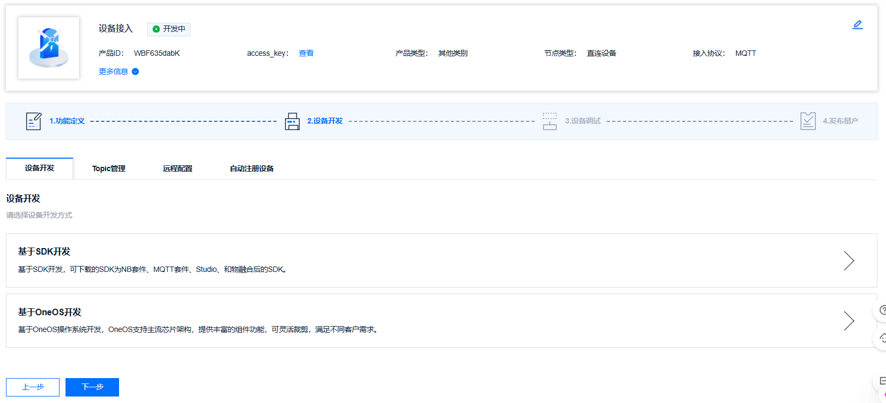
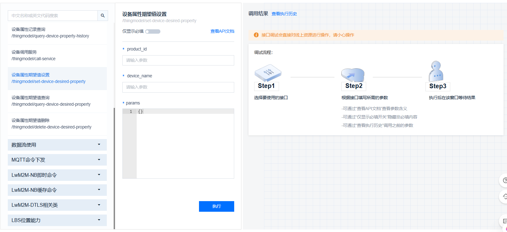

# Onenet移植手册

本手册为读者移植我们的Onenet组件的一些方法，如有不对的地方，请包含与谅解！

————by wsoz/OHB666


## Onenet组件库

​	进入到我工程的 `sample_project\components\onenet_esp32`将整个组件移植到自己的工程同时需要将`my_wifi`组件一起移植为我们提供wifi连接，然后需要注意的是组件中的`tm_user.c`和`tm_user.h`需要替换为自己产品设备的特定文件，具体方法如下：

下载官方的SDK，然后解压出来替换我原本工程中的SDK即可




## Onenet数据连接和上传

​	此处可以进入到我们的一个应用层`main\myapp`中的文件，将`my_wifi_app`以及`my_onenet`文件移植到自己工程，前者提供的是wifi的连接功能，后者主要为我们提供Onetnet的相关操作。

**配置**：

1. 修改my_onenet.c文件中宏定义替换自己的产品密钥等
2. 进入menuconfig配置我们的wifi初始化项


我目前在`my_wifi_app`中实现的就是数据上行，主要依靠一个发送线程来实现，目前我写了一个`temperature`的模型上云进行操作，后续如果在自己工程中不同的可以自己修改，如果有多个数据需要上云的话，我推荐**多开线程**进行处理以适应不同模型数据上云的频率。

然后对于相关的数据发送频率等我们也可以在文件修改

```c
#define CONNECT_TIMEOUT         30000     // 连接超时时间 (增加到30秒)
#define SEND_TIMEOUT    1000   // 数据发送时间 
```

然后对于其中的一些Onenet应用层API如果不懂得可以自行在查询官方文档，我这里只作简介

**设备上线**

```c
int32_t tm_login(const char *product_id, const char *dev_name,
                 const char *access_key, uint64_t expire_time,
                 uint32_t timeout_ms)
```

**创建模型实例**

```c
void *tm_data_create()
```

**为模型赋值**

```c
int32_t tm_data_set_float(void *data, const int8_t *name, float32_t val,
                          uint64_t timestamp)
int32_t tm_data_set_int32(void *data, const int8_t *name, int32_t val,
                          uint64_t timestamp)
int32_t tm_data_set_bool(void *data, const int8_t *name, boolean val,
                         uint64_t timestamp)
```

**数据上传**

```c
int32_t tm_post_property(void *prop_data, uint32_t timeout_ms)
```


## Onenet接收命令

​	对于接收命令，我们无需额外的一个接收线程，Onenet的架构会自动处理云端的下发，**通过回调函数的形式进行触发**，这也是我为什么在开头需要让你们替换`tm_user.c`和`tm_user.h`的原因。

​	进入到我工程的代码里可以看见我云端定义的一些物理模型全都通过回调函数的形式进行了触发。我的工程目前就是实现的接收云端上下发的设置物理模型期望值。

```c
int32_t tm_prop_temperature_wr_cb(void *data)
{
    // 增强调试信息 - 检查数据指针有效性
    if (data == NULL) {
        ESP_LOGE("TM", "rec:temperature: data pointer is NULL!");
        return -1;
    }

    // 正确的cJSON解析方式
    // OneNET SDK传递的是cJSON对象，需要解析其中的value字段
    float64_t temp_value = 0.0;

    // 检查是否是cJSON对象格式
    if (((cJSON *)data)->type == cJSON_Object) {
        cJSON *value_item = cJSON_GetObjectItem((cJSON *)data, "value");
        if (value_item != NULL) {
            temp_value = value_item->valuedouble;
            ESP_LOGI("TM", "rec:temperature: parsed from cJSON object value = %.6f", temp_value);
        } else {
            ESP_LOGE("TM", "rec:temperature: cJSON object has no 'value' field!");
            return -1;
        }
    } 
    // 打印cJSON对象信息
    ESP_LOGI("TM", "rec:temperature: cJSON type = %d, string = %s",
             ((cJSON *)data)->type,
             ((cJSON *)data)->string ? ((cJSON *)data)->string : "NULL");

    ESP_LOGI("TM", "rec:temperature: Final parsed value = %.6f", (float32_t)temp_value);
    return 0;
}
```

**注意：**回调函数中的传参是cJSON格式，所以需要借助cJSON库来进行解析出云端下发的数据

然后我们就可以通过云端API调试进行测试，对每一个不同事件进行触发了比如：开灯/关灯等。



**cJSON数据解析**

 对于OneNET回调函数，90%的情况下只需要这三个API：

  1. cJSON_GetObjectItem() - 获取字段
  2. cJSON_IsObject() - 检查类型
  3. item->valuedouble - 获取数值


如果你的物理模型也有`temperature`这个参数，你可以先用我的工程进行测试，后续在进行移植。


然后目前我的工程就是一个最简单的配置，如果还需要**开启安全选项**的话，可以参考 `sample_project\mqtts_onejson_soc_v2.1.3 `中的`redme.md`文档进行配置一个宏定义即可。

最后感谢你下载我的工程文件，如果能给个==Star==就更好了，感激不尽感激不尽！
